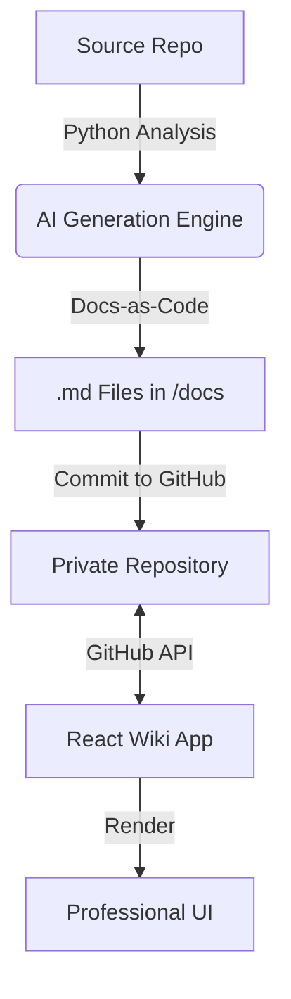

# 📖 AI Code Wiki System
> **The Intelligent Bridge Between Your Code and Your Documentation.**

[](https://react.dev/)
[](https://www.typescriptlang.org/)
[](https://vitejs.dev/)
[](https://tailwindcss.com/)
[](LICENSE)

---

## 🌟 Overview
**AI Code Wiki** is a modern "Docs-as-Code" platform designed to simplify technical documentation. Inspired by high-efficiency internal wiki systems (like those at Google), it leverages **Generative AI** to analyze your codebase and automatically generate Architectural, Functional, and Development guides that live directly within your repository.

The frontend dashboard provides a seamless, real-time reading experience by fetching your private GitHub documentation via API and rendering it with a premium, responsive UI.

---

## ⚙️ How it Works: The Ecosystem Flow

The **AI Code Wiki** operates on a modular "Analyze -> Generate -> Render" lifecycle. This ensures that documentation is not a static artifact but a living part of the development process.

### 1. The Analysis Phase (Python Engine)
The system uses a set of Python-based analysis scripts (e.g., `check_models.py`, `generate_docs.py`) to scan the target repository.
*   **Context Gathering**: The engine reads source files (`.ts`, `.tsx`, `.scss`) to understand the application's structure.
*   **AI Synthesis**: Using the **Google Gemini API**, the scripts perform multi-prompting to generate distinct documentation layers: **Architectural**, **Functional**, and **Development**.

### 2. The Persistence Phase (Docs-as-Code)
The generated Markdown files are automatically saved into a specific directory structure within the target repository (typically `/docs`).
*   **Version Control**: Because the docs are committed to GitHub, they benefit from full versioning, branching, and history tracking.

### 3. The Visualization Phase (React App)
The frontend application (`ai-docs-wiki-generator`) acts as the presentation layer.
*   **GitHub REST API**: It securely fetches the content of the `/docs` folder from the private repository.
*   **Stateful Rendering**: Using **Redux Toolkit**, it manages complex file trees and renders docs with a scroll-synced sidebar (Intersection Observer).

---

## 🛠️ Configuration & Setup

To get the full system running, you need to configure two main components: **GitHub API Access** and **Google Gemini AI**.

### 1. GitHub Configuration
You need a **Personal Access Token (Classic)** with the `repo` scope to read private repositories.
*   Generate one at: `GitHub Settings > Developer settings > Personal access tokens`.

### 2. AI Configuration (Gemini API)
The system uses Google's Gemini models for high-quality code analysis.
*   Go to the [Google AI Studio](https://aistudio.google.com/).
*   Create a New API Key.
*   (Recommended) Check available models using `python check_models.py`.

### 3. Environment Setup
Create a `.env.local` file in the root directory and populate it with your credentials (use `.env.example` as a template):

```env
# GitHub Integration
VITE_GITHUB_TOKEN="your_github_pat_here"
VITE_TARGET_REPO_OWNER="your_username"
VITE_TARGET_REPO_NAME="your_repo_name"

# AI Integration
VITE_GEMINI_API_KEY="your_google_gemini_api_key_here"
```

---

## 📐 Architecture Overview



---

## 🚀 Getting Started

### 1. Prerequisites
- Node.js (v18+)
- Python (v3.10+) for generation scripts
- GitHub Personal Access Token

### 2. Installation
```bash
git clone https://github.com/your-username/ai-docs-wiki-generator.git
cd ai-docs-wiki-generator
npm install
```

### 3. Run Development Server
```bash
npm run dev
```

---

## 🤝 Contributing
Contributions are what make the open-source community such an amazing place to learn, inspire, and create. Any contributions you make are **greatly appreciated**.

1. Fork the Project
2. Create your Feature Branch (`git checkout -b feature/AmazingFeature`)
3. Commit your Changes (`git commit -m 'Add some AmazingFeature'`)
4. Push to the Branch (`git push origin feature/AmazingFeature`)
5. Open a Pull Request

---

## 📝 License
Distributed under the MIT License. See `LICENSE` for more information.

---

*Developed with ❤️ and AI collaboration (Antigravity).*
